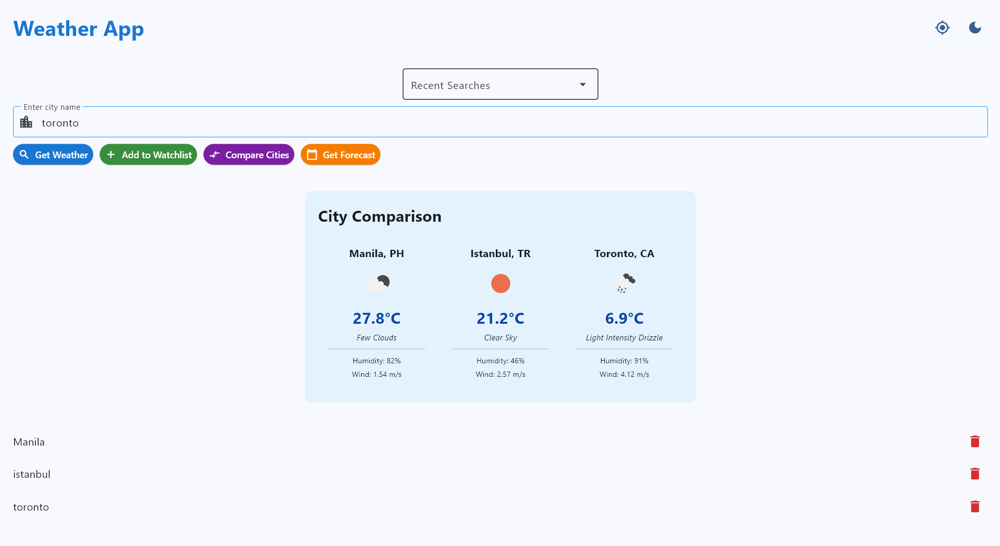
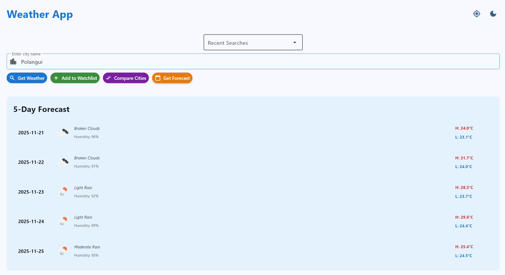

# Weather Application - Module 6 Lab

## Student Information
- **Name**: Carl James D. Poopalaretnam
- **Student ID**: 231003483
- **Course**: CCCS 106
- **Section**: BSCS-3B

## Project Overview
[Brief description of your weather app and what it does]

## Features Implemented

### Base Features
- [x] City search functionality
- [x] Current weather display
- [x] Temperature, humidity, wind speed
- [x] Weather icons
- [x] Error handling
- [x] Modern UI with Material Design

### Enhanced Features
1. **Multiple Cities Comparison (Medium)**
   - Description of what this feature does
    Allow users to add multiple cities to a watchlist
    Display weather for all cities simultaneously
    Show side-by-side comparison
    Save watchlist for next session

   - Why you chose this feature
    I have relatives from other countries that's why I did this feature.

   - Challenges faced and how you solved them
   I'm still not used to flet so I look for solutions on flet docu and also request guide from AI.
    
2. **Current Location Weather (Medium)**
   - Description of what this feature does
    Use IP-based geolocation to detect user's city
    Add a "My Location" button
    Automatically fetch weather on app start

   - Why you chose this feature
    To see my current location without typing it. Just by clicking the location icon it alreade shows the weather forcast.
   - Challenges faced and how you solved them
    The code is already provided but puting it in the code and aligning the icon are the challenge for me. Found answer on flet docu about aligning.

3. **5-Day Weather Forecast (Medium)**
   - Description of what this feature does
    Add a forecast view showing next 5 days
    Display daily high/low temperatures
    Show weather conditions for each day

   - Why you chose this feature
   I want to see the upcoming weather condition on locations. To also see if it's a good idea to go there within the next 5 days. 

   - Challenges faced and how you solved them
   The challenge is all of it I wasted a lot of time here that's why I look for flet docu and request help for AI. For debugging I requested a lot of help from AI.


## Screenshots
[Add 3-5 screenshots showing different aspects of your app]

Current Location Weather


Multiple Cities Comparison


5-Day Weather Forecast


## Installation

### Prerequisites
- Python 3.8 or higher
- pip package manager

### Setup Instructions
```bash
# Clone the repository
git clone https://github.com/Itscrl/cccs106-projects.git
cd cccs106-projects/mod6_labs

# Create virtual environment
python -m venv venv
source venv/bin/activate  # On Windows: venv\Scripts\activate

# Install dependencies
pip install -r requirements.txt

# Create .env file
cp .env.example .env
# Add your OpenWeatherMap API key to .env
