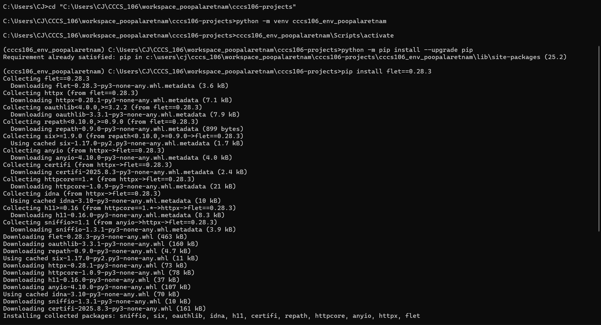
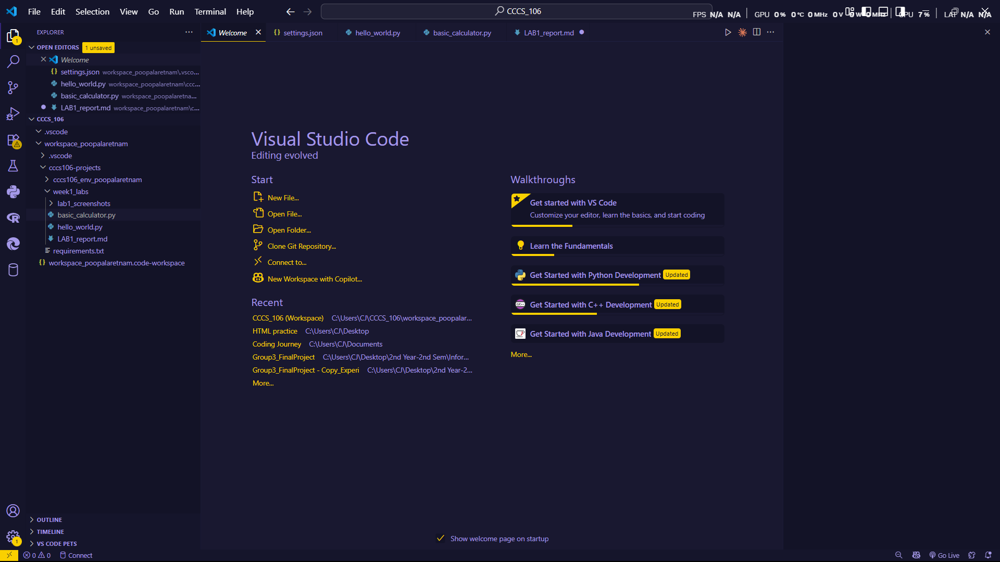
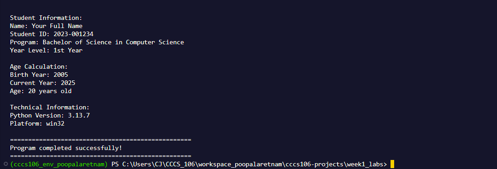
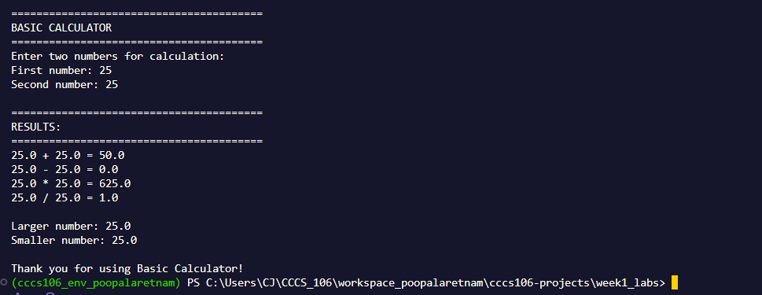

# Lab 1 Report: Environment Setup and Python Basics

**Student Name:** Carl James Dacara Poopalaretnam
**Student ID:** 231003483
**Section:** BSCS-3B
**Date:** September 3, 2025

## Environment Setup

### Python Installation
- **Python Version:** 3.13.17
- **Installation Issues:** There's no problem with the installation because I already have python installed.
- **Virtual Environment Created:** ✅ cccs106_env_poopalaretnam

### VS Code Configuration
- **VS Code Version:** 1.1012
- **Python Extension:** ✅ Installed and configured
- **Interpreter:** ✅ Set to cccs106_env_poopalaretnam/Scripts/python.exe

### Package Installation
- **Flet Version:** 0.28.3
- **Other Packages:** anyio==4.10.0
certifi==2025.8.3
h11==0.16.0
httpcore==1.0.9
httpx==0.28.1
idna==3.10
oauthlib==3.3.1
repath==0.9.0
six==1.17.0
sniffio==1.3.1

## Programs Created

### 1. hello_world.py
- **Status:** ✅ Completed
- **Features:** Student info display, age calculation, system info
- **Notes:** None, just copy and paste the code.
### 2. basic_calculator.py
- **Status:** ✅ Completed
- **Features:** Basic arithmetic, error handling, min/max calculation
- **Notes:** None, just copy and paste the code. 

## Challenges and Solutions

During the environment setup, I had a problem with the directory of the folder. It returns "The filename, directory name, or volume label syntax is incorrect." so the solution I did was open the file explorer from there I get the actual directory, paste it in cmd and it works.

## Learning Outcomes
Althought, this is not my first time in doing it, but still I forgot it. From this task I have refreshed my knowledge and also I have learned something new.

## Screenshots

